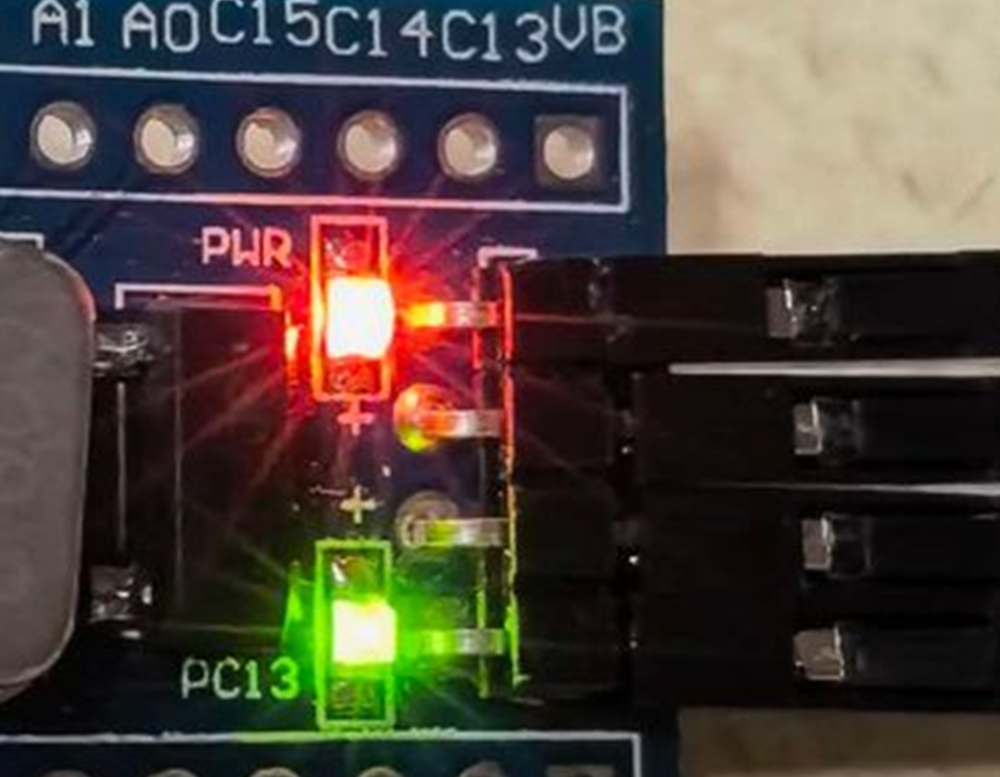
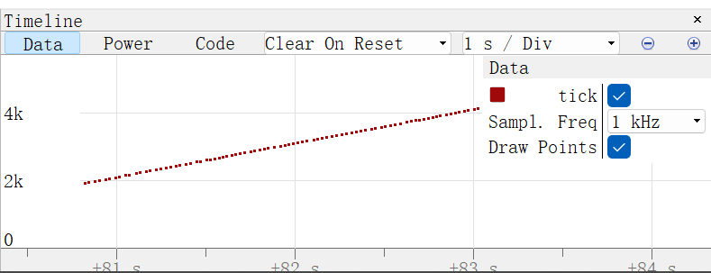
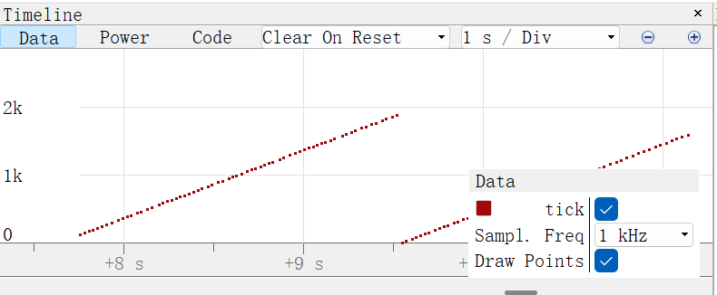

# 附录

## 一、第 1 题 GPIO

PC13 配成推挽输出，在 `Tasks` 的初始化 `MyTaskInit()` 里置低电平点亮板载 LED，
`while (1)` 保持为空，不做翻转。



## 二、第 2 题 定时器

### 回调

```c
extern "C" void HAL_TIM_PeriodElapsedCallback(TIM_HandleTypeDef *htim)
{
  if (htim == &htim2)
  {
    tick++;
    HAL_IWDG_Refresh(&hiwdg);
  }
}
```

### PSC / ARR 计算

HSE 8 MHz 经 PLL 九倍频得到 SYSCLK = 72 MHz。APB1 分频为 2，得 APB1 = 36 MHz；
因为 APB1 分频不为 1，定时器时钟是 APB1 的 2 倍，即 72 MHz。

要得到 1 ms 周期，令计数时钟为 1 MHz：

```
计数时钟 = 72 MHz / (PSC + 1) = 1 MHz   →   PSC = 72 - 1 = 71
中断周期 = (ARR + 1) / 计数时钟 = 1 ms   →   ARR = 1000 - 1 = 999
```

代入题目给的公式验证：

```
(PSC + 1) × (ARR + 1) / 定时器时钟
= 72 × 1000 / 72 MHz
= 0.001 s
```

程序运行后，`tick` 每秒增加 1000。



## 三、第 3 题 看门狗

IWDG 分频 64，Reload 1249，LSI 按手册取 F103 的约 40 kHz：

```
超时 = (Reload + 1) × 分频 / LSI
     = (1249 + 1) × 64 / 40000
     = 2.0 s
```

把回调里的 `HAL_IWDG_Refresh` 去掉（`FEED_WATCHDOG` 改成 0）重新下载后，
芯片每约 2 秒复位一次。复位后启动代码把全局变量清零，因此 `tick` 从 0 涨到约 2000 再归零，不断重复。



## 四、实测验证

用 DAPLink 直接读芯片寄存器和内存，确认各项配置与现象：

| 项目 | 期望 | 实测 |
|---|---|---|
| SYSCLK 源 | PLL | PLL |
| HSE 就绪 / PLL 锁定 | 1 / 1 | 1 / 1 |
| APB1 定时器时钟 | 72 MHz | 72 MHz |
| TIM2 PSC / ARR | 71 / 999 | 71 / 999 |
| TIM2 计数 | 运行 | 运行 |
| IWDG 分频 / Reload | 64 / 1249 | 64 / 1249 |
| PC13 电平 | 0（点亮） | 0 |
| tick 增速（第 2 题） | 1000 次/秒 | 1000.0 次/秒 |
| tick 峰值与周期（第 3 题） | 约 2000，约 2 s | 1908~1914，1.9 s |
